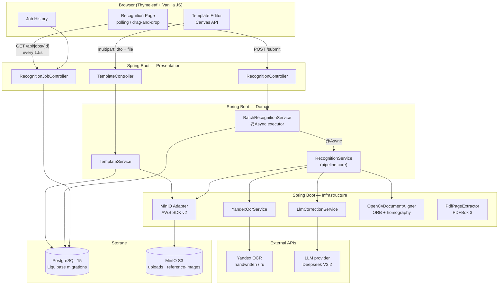
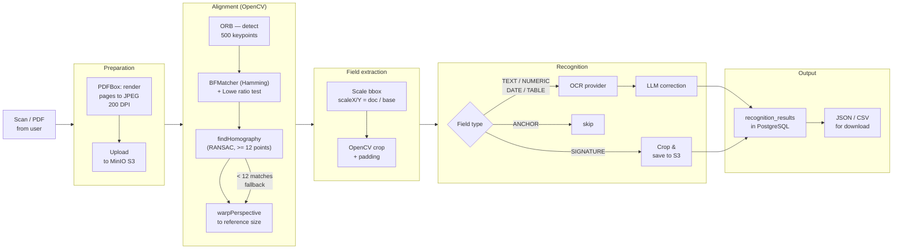

<div align="center">
    <picture>
    <source media="(prefers-color-scheme: dark)" srcset="banner-dark.svg">
    <source media="(prefers-color-scheme: light)" srcset="banner-light.svg">
    
    </picture>
</div>

> [Русская версия](README_RU.md)

[](https://openjdk.org/)
[](https://spring.io/projects/spring-boot)
[](https://www.postgresql.org/)
[](https://opencv.org/)
[](https://www.docker.com/)
[](LICENSE)

Batch digitization tool for handwritten historical documents. Draw a template once — mark the fields you need on a sample page. The system then processes any number of similar documents automatically: crops regions, runs OCR, and corrects errors with an LLM. Output is a structured table ready for analysis.

## Why

Manual transcription of handwritten text is slow. A single document with a dozen fields takes minutes to half an hour. At the scale of thousands of archival items, that's years of work.

Existing solutions are either unaffordable (Transkribus, ABBYY), poor quality on Russian handwriting (Tesseract, TrOCR), or cost hundreds of thousands of rubles (Smart Engines). This tool takes a different approach: no programming required, visual interface, modular OCR pipeline that can switch providers without touching business logic.

## How it works

```
Upload sample → Mark fields → Process batch → Get CSV/JSON
```

1. User uploads a sample document and draws rectangles around target fields — coordinates are stored relative to the reference image size
2. For each new document, a scale factor is computed; OpenCV crops the marked zones with padding
3. Cropped fragments go to the OCR provider (currently Yandex Cloud OCR, `handwritten` model)
4. Raw text is passed to an LLM for context-aware error correction
5. Output: JSON with recognized fields; signatures are saved as Base64 images

## Features

- **Template editor** — visual field markup (text, numbers, signatures) via Canvas API, no coding
- **Batch processing** — one template for thousands of documents
- **LLM correction** — recovers meaning where OCR misread a character
- **Multi-page PDFs** — separate markup per page
- **Export** — JSON and CSV; full processing job history
- **Modular architecture** — swap OCR or LLM provider by changing one interface implementation

## Tech Stack

| Layer | Technologies |
|-------|-------------|
| Backend | Java 17, Spring Boot 3.2.5, Spring Data JPA, Hibernate |
| Database | PostgreSQL 15, Liquibase |
| Object storage | MinIO (S3-compatible), AWS SDK v2, presigned URLs |
| Image processing | OpenCV 4.9 (openpnp) — alignment, crop, homography |
| PDF | Apache PDFBox 3.0.2 — page rendering to JPEG |
| OCR | Yandex Cloud OCR API, `handwritten` model |
| LLM post-processing | Deepseek V3.2 via Yandex AI Studio |
| Frontend | Thymeleaf, Vanilla JS (ES modules), Canvas API |
| Infrastructure | Docker, Docker Compose, Eclipse Temurin 17 |
| API docs | SpringDoc OpenAPI (Swagger UI) |
| Mapping | MapStruct, Lombok |

## Architecture

Built on **Hexagonal Architecture** (ports & adapters): the domain layer knows nothing about specific external services — it works only through port interfaces. This allowed swapping the OCR provider three times during development without touching the core.



## Document pipeline



## Quality metrics

Tested on real archival documents. Test corpus used full pages without field markup — a harder condition than production (where the system receives clean cropped fragments).

| Document type | CER without LLM | CER with LLM | WER without LLM | WER with LLM |
|---|---|---|---|---|
| Typewritten (Soviet era) | 7.21% | **4.35%** | 37.78% | **16.74%** |
| Handwritten (early 20th c.) | 22.41% | **16.98%** | 57.71% | **41.91%** |

> CER < 10% is acceptable for research; CER < 3% is the professional archival standard.

LLM correction reduces typewritten CER to 4.35% and halves WER. On early 20th-century handwriting the improvement is more modest — Yandex OCR was trained predominantly on modern handwriting, a structural limitation that post-processing alone cannot fully overcome.

<details>
<summary>Test sources</summary>

- Typewritten: GASO, fond R-2020, inventory №1, pp. [231](https://yandex.ru/archive/catalog/742f3d4a-4dab-4a2c-91c9-04c7a136a4cf/231), [232](https://yandex.ru/archive/catalog/742f3d4a-4dab-4a2c-91c9-04c7a136a4cf/232), [233](https://yandex.ru/archive/catalog/742f3d4a-4dab-4a2c-91c9-04c7a136a4cf/233), [236](https://yandex.ru/archive/catalog/742f3d4a-4dab-4a2c-91c9-04c7a136a4cf/236), [237](https://yandex.ru/archive/catalog/742f3d4a-4dab-4a2c-91c9-04c7a136a4cf/237), [238](https://yandex.ru/archive/catalog/742f3d4a-4dab-4a2c-91c9-04c7a136a4cf/238)
- Handwritten: Kopylov case (1906), pp. [9](https://yandex.ru/archive/catalog/065eadb5-c558-42c6-86ef-d113eaee71b3/9), [10](https://yandex.ru/archive/catalog/065eadb5-c558-42c6-86ef-d113eaee71b3/10), [12](https://yandex.ru/archive/catalog/065eadb5-c558-42c6-86ef-d113eaee71b3/12), [14](https://yandex.ru/archive/catalog/065eadb5-c558-42c6-86ef-d113eaee71b3/14)

</details>

## OCR stack selection

| Solution | Result |
|---|---|
| Tesseract | Good on print; unacceptable on handwriting |
| Surya (neural) | Better than Tesseract, insufficient for Soviet handwriting |
| PaddleOCR | Unstable results |
| HuggingFace (Church Slavonic models) + Surya | ~7–10 sec/word — hours per document |
| **Yandex OCR + Deepseek V3.2** | ✅ Best quality on Russian handwriting |

## Run

```bash
git clone https://github.com/notakeith/handscribe.git
docker compose up --build
```

Template editor: [http://localhost:8080/templates/editor](http://localhost:8080/templates/editor)  
Swagger UI: [http://localhost:8080/swagger-ui.html](http://localhost:8080/swagger-ui.html)

## Known limitations

**Variable table geometry** — the system works with fixed rectangles. If column widths vary between documents, markup drifts. Fix: detect table lines via OpenCV as a first pass.

**Perspective distortion** — documents must be scanned reasonably flat. Auto-alignment via anchor points (warp perspective) is not implemented.

**Prompt injection** — if a document contains text like "ignore previous instructions", the LLM will follow it. Basic filtering is in place; proper protection requires dedicated work.

**No async feedback** — batch processing takes ~1 minute; the user waits without progress updates. SSE or WebSocket needed instead of polling.

## Roadmap

- Automatic table boundary detection from document lines
- Fine-tuning OCR model on a specific document type
- Server-Sent Events for job completion notifications
- Support for multiple OCR providers selectable by the user
